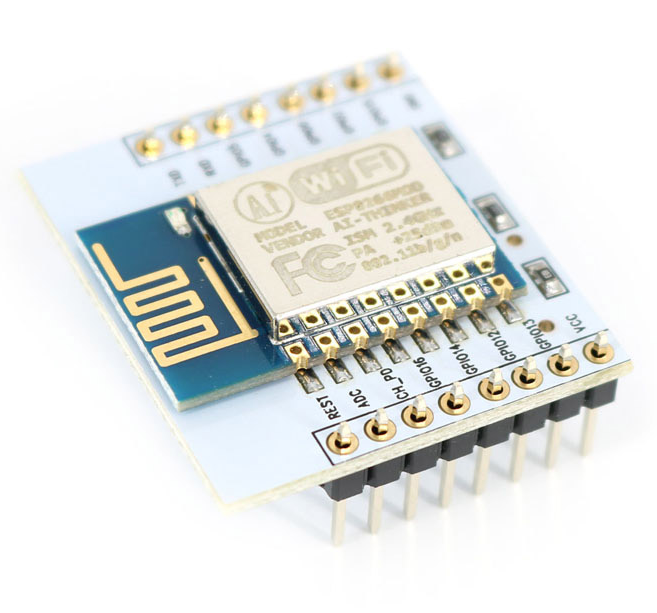

# Mavlink2Gopro
Is an Interface to control Gopro Hero 4 Silver Camera using Mavlink data stream issued by a drone flight controller.

For that I use an ESP8266-12 board of which Rx input is connected to the MavLink Tx output of the flight controller. The software build with the arduino environnement, analyse the MavLibk data stream to extract the Remote Control channel 8 values, and issue needed http requests after connection to the GoPro Wifi hotspot.

For the Gopro http commands, I've used this documentation : https://github.com/KonradIT/goprowifihack/blob/master/HERO4/WifiCommands.md

For MavLink decoding, I've used this documentation :
- https://discuss.ardupilot.org/t/mavlink-and-arduino-step-by-step/25566
- https://github.com/mavlink/mavlink
And this library :
- https://discuss.ardupilot.org/uploads/default/original/2X/0/064748b43308485aa9bd0d86fb91d74e17ed8c2a.zip

For my purpose I chose an ESP8266 sold with a small PCB to support a 3.3 V regulator to reduce the 5V available on my drone to 3.3V (watch to remove the 0 ohm resistor which a shunt used if the regulator is not weld :

